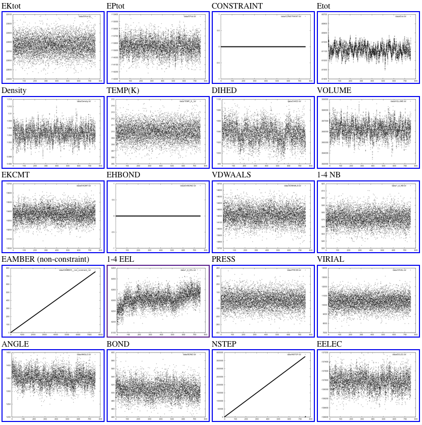
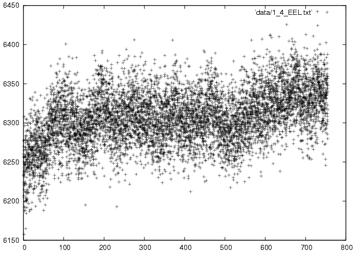
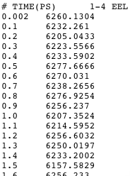

Graphical display of MD properties over time
============================================

parse_sander_output.py
----------------------

Analyzing MD simulations requires assessment of the convergence of
dynamic properties, such as temperature, pressure, total energy,
potential energy, kinetic energy, and various error estimates. This
assessment is facilitated with PyPAT. The AMBER MD engine, sander,
outputs the dynamic property information to a text file. 

``parse_sander_output.py`` parses this file and compiles data of the
relevant quantities vs. time in tab-delimited files. It then generates
graphical images of the time-evolution of the properties and an html
file that shows thumbnails of all these images, nested with links to
larger versions.

HTML overview
~~~~~~~~~~~~~

The HTML overview from a short MD simulation looks like:

Larger images
~~~~~~~~~~~~~

Clicking on individual thumbnails leads to larger images like:

Underlying data
~~~~~~~~~~~~~~~

One more click shows the underlying data in a tab-delimited format
easily read by Excel and other scripts:

Documentation from the script
-----------------------------

::

  Usage: 
  parseSanderOut.py -f file.out -d dirname
  
  will put the data in file.out into nice files in dirname.
  The directory called dirname must not exist when this script is run.
  Among those files are:
  
    data/allout.txt      tab-delimited text file with all information
                         (suitable for gnumeric, koffice or excel)
    data/Etot.txt, etc.  individual files with different types of sander
                         output (two columns per file, one is time(ps))
    results.html         html file showing you lots graphs of your data
    images/*             postscript and gif graphs of your data
  
  So, for the most part, you probably just want to point your favorite
  webbrowser at dirname/results.html.
  
  NOTE: this script assumes that you have gnuplot and convert installed
  and in your path.
  
  
  Options:
    -h, --help            show this help message and exit
    -f DATAFILENAME, --file=DATAFILENAME
                          The name of the sander output file to parse [default
                          sander.out]
    -d OUTDIR, --dir=OUTDIR
                          The name of the output directory (must not exist)
                          [default data]
  
